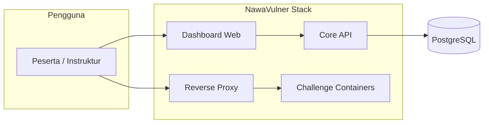

# NawaVulner
## Software Design Document (SDD) v1.0

> **Platform latihan keamanan web OWASP Top 10:2025 — desain perangkat lunak untuk MVP v1.0**

| Atribut | Nilai |
|---------|--------|
| Versi | 1.0.0 |
| Status | Draft implementasi |
| Sumber kebutuhan | [prd/NawaVulner_PRD_v1.0.md](../prd/NawaVulner_PRD_v1.0.md) |
| Target cakupan | MVP v1.0 (60 challenge, hybrid Docker) |

---

## Daftar Isi

1. [Tujuan dokumen & ruang lingkup](#1-tujuan-dokumen--ruang-lingkup)
2. [Asumsi, batasan, dependensi](#2-asumsi-batasan-dependensi)
3. [Traceability PRD → SDD](#3-traceability-prd--sdd)
4. [Konteks sistem & stakeholder teknis](#4-konteks-sistem--stakeholder-teknis)
5. [Arsitektur logis](#5-arsitektur-logis)
6. [Arsitektur deployment (Docker)](#6-arsitektur-deployment-docker)
7. [Komponen & tanggung jawab](#7-komponen--tanggung-jawab)
8. [Desain data](#8-desain-data)
9. [Desain API (ringkas)](#9-desain-api-ringkas)
10. [Alur bisnis utama](#10-alur-bisnis-utama)
11. [Kontrak challenge container & proxy](#11-kontrak-challenge-container--proxy)
12. [Keamanan platform (bukan challenge)](#12-keamanan-platform-bukan-challenge)
13. [Konfigurasi & environment](#13-konfigurasi--environment)
14. [Observabilitas, logging, error handling](#14-observabilitas-logging-error-handling)
15. [i18n & konten](#15-i18n--konten)
16. [NFR & skalabilitas](#16-nfr--skalabilitas)
17. [Strategi pengujian](#17-strategi-pengujian)
18. [Keputusan desain terbuka](#18-keputusan-desain-terbuka)

---

## 1. Tujuan dokumen & ruang lingkup

### 1.1 Tujuan

Dokumen ini menjelaskan **bagaimana** NawaVulner diimplementasikan agar memenuhi PRD v1.0: struktur layanan, data, antarmuka, pola integrasi antar container, serta kebijakan keamanan untuk **platform inti** (dashboard, API, DB, proxy). Lab vulnerable (**challenge containers**) dirancang sengaja rentan; isolasi dan batasan eksekusi diatur di sini dan di PRD bagian risiko.

### 1.2 Ruang lingkup SDD

| Termasuk | Tidak termasuk (di luar SDD v1.0) |
|----------|-----------------------------------|
| Arsitektur hybrid + Nginx routing | Implementasi exploit per challenge (hanya kontrak & pola) |
| Skema data scoring, progress, hint, writeup | Konten naratif lengkap setiap challenge |
| API auth, flag, progress, lab lifecycle | Hosting cloud managed (self-hosted only) |
| Kebijakan hardening container platform | Sertifikasi formal kepatuhan |

---

## 2. Asumsi, batasan, dependensi

### 2.1 Asumsi

- Pengguna menjalankan stack via **Docker Compose** pada mesin yang memenuhi spesifikasi PRD (CPU/RAM/Disk).
- Traffic challenge diarahkan melalui **nawa-proxy**; pengguna tidak memetakan port setiap challenge secara manual ke host (kecuali mode dev opsional).
- Bahasa UI: **bilingual** (ID + EN) dengan sumber string terpusat atau file locale.

### 2.2 Batasan

- MVP tidak mensyaratkan multi-tenant terpisah secara organisasi; **satu instance** = satu lingkungan lab (boleh multi-user akun lokal).
- Challenge di PRD memakai stack campuran per modul; setiap image **mandiri** dengan port internal tetap (kontrak di §11).

### 2.3 Dependensi eksternal

- Docker Engine 24+ (atau setara), Docker Compose v3.
- Browser modern untuk dashboard; level Hard mengasumsikan alat seperti Burp (PRD).

---

## 3. Traceability PRD → SDD

| Bagian PRD | Pemetaan di SDD |
|------------|-----------------|
| §5 Arsitektur Platform | §5, §6, §7, §11 |
| §6 Fitur MVP | §8, §9, §10 |
| §7 Challenge Design | §11 (kontrak), backlog implementasi per repo `challenges/*` |
| §8 Tech Stack | §5, §7, §13 |
| §9 Docker Deployment | §6, §13 |
| §10 Gamifikasi | §8 (entitas skor, hint penalty), §10 |
| §11 UI/UX | §7 (dashboard), aset tema; detail UI bisa diturunkan ke ADR/UI kit terpisah |
| §12 Roadmap | Urutan delivery; tidak mengubah desain arsitektur |
| §13 Risiko & Mitigasi | §12, §16 |

---

## 4. Konteks sistem & stakeholder teknis

### 4.1 Diagram konteks (ringkas)

- **Dashboard**: SPA (React + Vite) memanggil Core API untuk auth, daftar challenge, submit flag, hint, progress.
- **Proxy**: satu pintu masuk HTTP ke challenge yang dipilih (routing berbasis path atau subdomain — lihat §11).
- **Challenge**: aplikasi web vulnerable terisolasi; tidak memegang state persisten scoring (stateless; reset lab).

---

## 5. Arsitektur logis

### 5.1 Lapisan

| Lapisan | Komponen | Catatan |
|---------|----------|---------|
| Presentasi | `nawa-dashboard` | Tailwind; state client; tidak menyimpan secret |
| Aplikasi | `nawa-api` | Express; validasi input; otorisasi sumber daya pengguna |
| Data | `nawa-db` | PostgreSQL 15; volume named untuk persistensi |
| Edge | `nawa-proxy` | Nginx; TLS opsional (self-hosted); rate limit opsional per route |
| Lab | `challenge-*` | Satu service per challenge (PRD) atau grup kecil jika diperlukan optimasi resource — keputusan §18 |

### 5.2 Pola komunikasi

- Dashboard ↔ API: **HTTPS** (localhost) atau HTTP di dev; JSON REST.
- Proxy ↔ Challenge: HTTP internal pada Docker network; **tidak** mengekspos DB ke network challenge.

---

## 6. Arsitektur deployment (Docker)

### 6.1 Topologi jaringan

Selaras PRD §5.2:

- Satu **user-defined bridge network** default untuk core (`dashboard`, `api`, `db`, `proxy`).
- Challenge dapat berada pada **network yang sama** dengan label/routing ketat proxy, atau **network per-challenge** + proxy terhubung ke banyak network (Compose `networks`). Rekomendasi MVP: **satu network internal** + routing unik per challenge path untuk mengurangi kompleksitas Compose.

### 6.2 Volume

| Volume | Mount ke | Isi |
|--------|-----------|-----|
| `nawa_pg_data` | `nawa-db` | Data PostgreSQL |
| Opsional `nawa_uploads` | API | Jika ada artefak non-DB (MVP bisa tanpa) |

Challenge: **tanpa volume persisten** kecuali tmp/ephemeral untuk demo; reset lab = restart container atau skrip in-container init.

### 6.3 Port host (disarankan)

| Service | Port host (contoh) | Keterangan |
|---------|-------------------|------------|
| Dashboard | `3000` | PRD |
| API | `3001` internal; dashboard memakai proxy dev atau env `VITE_API_URL` | Hindari expose DB ke host |
| Proxy | `8080` | Entry challenge dari browser jika tidak dipakai path-based di origin sama |
| PostgreSQL | hanya internal | |

Port pasti dapat disesuaikan via `.env`; SDD mendefinisikan **nama service** sebagai kontrak, bukan angka port tetap.

---

## 7. Komponen & tanggung jawab

### 7.1 `nawa-dashboard` (React + Vite)

- Halaman: landing, register/login, profil, grid challenge, detail challenge, riwayat submission.
- Akses lab: membuka URL proxy + token/session valid (opsional: one-time lab session id).
- i18n: toggle atau deteksi preferensi; string EN/ID.

### 7.2 `nawa-api` (Node.js + Express)

- Autentikasi & sesi pengguna (§9.1).
- CRUD logika untuk: user, challenge metadata (baca dari DB seed), progress, submission flag, hint unlock, writeup unlock.
- Validasi flag format `FLAG{...}` + hash per challenge di DB (bukan plaintext flag di production).
- Orkestrasi **reset lab**: memanggil Docker API atau menjalankan skrip sidecar — **keputusan implementasi** §18; MVP bisa `docker compose restart challenge-xxx` via socket mount (hati-hati) atau endpoint admin-only internal.

### 7.3 `nawa-db` (PostgreSQL 15)

- Sumber kebenaran untuk akun, progress, skor, audit submission.
- Migration terversioning (mis. `node-pg-migrate` / Prisma / Drizzle — pilih satu di repo).

### 7.4 `nawa-proxy` (Nginx)

- Memetakan `location` ke upstream container challenge.
- Header keamanan untuk **dashboard** (bukan untuk halaman challenge yang sengaja vulnerable).

### 7.5 Challenge containers

- Image mandiri per PRD §9.2; healthcheck HTTP sederhana untuk readiness.
- Tidak menyimpan data pengguna platform; flag statis atau dihitung dari environment seed.

---

## 8. Desain data

### 8.1 Entitas inti

| Entitas | Deskripsi | Atribut utama |
|---------|-----------|----------------|
| `users` | Akun lokal | `id`, `username`, `email`, `password_hash`, `created_at`, `locale` |
| `challenges` | Metadata 60 challenge | `id`, `slug`, `owasp_category` (A01–A10), `difficulty`, `title_id`, `title_en`, `points_base`, `docker_service`, `proxy_path`, `flag_hash`, `order` |
| `user_challenge_progress` | Status per user-challenge | `user_id`, `challenge_id`, `status` (locked/unlocked/solved), `unlocked_at`, `solved_at` |
| `flag_submissions` | Audit | `id`, `user_id`, `challenge_id`, `submitted_text`, `correct`, `ip`, `created_at` |
| `hint_unlocks` | Hint per tingkat | `user_id`, `challenge_id`, `level` (1–3), `unlocked_at`, `points_penalty_applied` |
| `scores` | Materialized / derived | Total poin per user; bisa dihitung dari solves + penalty + bonus first blood |
| `first_blood` | Opsional | `challenge_id`, `user_id`, `solved_at` untuk bonus sesi |
| `badges` | Gamifikasi | `id`, `key`, `name_id`, `name_en`, `rule_json` |
| `user_badges` | Perolehan | `user_id`, `badge_id`, `earned_at` |
| `writeups` | Konten solve-gated | `challenge_id`, `body_encrypted` atau referensi file terenkripsi, `locale` |

### 8.2 Relasi ringkas

- `users` 1—N `user_challenge_progress`, `flag_submissions`, `hint_unlocks`, `user_badges`.
- `challenges` 1—N `user_challenge_progress`, `flag_submissions`, `hint_unlocks`.
- `badges` N—M `users` lewat `user_badges`.

### 8.3 Skor & penalty (dari PRD §10)

- **Base points** per difficulty: Easy 100, Medium 250, Hard 500.
- **Hint 2 / 3**: kurangi persentase dari base sesuai PRD (25% / 50% dari base untuk hint 2/3 — implementasi simpan `effective_points` pada event solve).
- **First blood**: bonus tetap per difficulty; definisi “sesi” = configurable (`FIRST_BLOOD_SCOPE=global|weekly|none`).

### 8.4 Indeks & performa

- Indeks unik `(user_id, challenge_id)` pada progress.
- Indeks `(challenge_id, created_at)` pada submissions untuk riwayat.

---

## 9. Desain API (ringkas)

Base path disarankan: `/api/v1`. Format error konsisten: `{ "error": { "code", "message", "details?" } }`.

### 9.1 Autentikasi

**Inkonsistensi PRD:** §6.1 menyebut *session-based*, §8.1 menyebut *JWT + bcrypt*.

| Opsi | Rekomendasi SDD |
|------|-----------------|
| A — JWT (stateless) | Access token pendek + refresh token di HTTP-only cookie, atau access di memory + refresh cookie |
| B — Session server-side | `connect.sid` cookie + store Redis/DB; lebih mudah revoke |

Untuk MVP self-hosted, **Opsi B (session server-side di PostgreSQL atau memory store)** selaras dengan kalimat PRD §6.1 dan mengurangi kompleksitas refresh. Jika tim memilih JWT, perbarui PRD agar konsisten.

**Endpoint (contoh)**

| Method | Path | Fungsi |
|--------|------|--------|
| POST | `/auth/register` | Buat user |
| POST | `/auth/login` | Buat sesi |
| POST | `/auth/logout` | Invalidate sesi |
| GET | `/auth/me` | Profil + ringkasan skor |

### 9.2 Challenge & lab

| Method | Path | Fungsi |
|--------|------|--------|
| GET | `/challenges` | Query: `category`, `difficulty`, `status`, `q` |
| GET | `/challenges/:slug` | Detail + status user |
| POST | `/challenges/:slug/lab/reset` | Reset state challenge (otorisasi + rate limit) |
| GET | `/challenges/:slug/lab-url` | URL aman ke proxy (bisa signed, TTL pendek) |

### 9.3 Flag & hint

| Method | Path | Fungsi |
|--------|------|--------|
| POST | `/challenges/:slug/flags` | Body: `{ "flag": "FLAG{...}" }` → validasi |
| POST | `/challenges/:slug/hints/:level` | Unlock hint level 1–3; terapkan penalty pada solve berikutnya |
| GET | `/challenges/:slug/writeup` | 403 sampai solved; konten bilingual dipilih query `?lang=` |

### 9.4 Leaderboard & stats

| Method | Path | Fungsi |
|--------|------|--------|
| GET | `/stats/me` | Poin, rank, badge, riwayat |
| GET | `/leaderboard` | Opsional MVP; pagination |

---

## 10. Alur bisnis utama

### 10.1 Submit flag (berhasil)

1. Klien kirim flag → API normalisasi string (trim, case policy eksplisit).
2. Cek user punya akses challenge (unlocked / free mode).
3. Bandingkan dengan **hash** (`bcrypt` / `argon2` — prefer Argon2 untuk string pendek dengan pepper dari env).
4. Jika benar: upsert progress `solved`, hitung poin (base − hint penalty + first blood?), tulis `flag_submissions`, cek badge rules, commit.
5. Respons: `{ solved: true, points_awarded, badges_earned[] }`.

### 10.2 Unlock hint

1. Validasi urutan hint (opsional: hint 2 butuh hint 1).
2. Catat `hint_unlocks`; penalty diterapkan pada **solve**, bukan pada unlock (sesuai PRD redaksi “mengurangi poin”).
3. Respons berisi teks hint untuk locale aktif.

### 10.3 Reset lab

1. Verifikasi ownership sesi / user.
2. Picu restart container atau skrip reset data challenge — idempotent.
3. Log audit `lab_reset` (user, challenge, waktu).

### 10.4 Mode unlock challenge

Environment `CHALLENGE_UNLOCK_MODE`:

- `free`: semua challenge unlocked (kecuali opsional hard gate instruktur).
- `strict`: rantai Easy → Medium → Hard per PRD §10.3; evaluasi di API pada setiap `GET challenges` dan saat start lab.

---

## 11. Kontrak challenge container & proxy

### 11.1 Identitas challenge

- `slug` unik global, mis. `a01-idor-basic`.
- `docker_service` nama service Compose untuk upstream Nginx.

### 11.2 Routing (disarankan)

- Pola URL: `http://localhost:<PROXY_PORT>/lab/<slug>/...` → upstream `http://<service>:<internal_port>/`.
- Nginx: `proxy_set_header Host` dan `X-Forwarded-Prefix /lab/<slug>` agar app challenge bisa membangun URL relatif (opsional).

### 11.3 Health

- Setiap image menyediakan `GET /health` → 200 JSON `{ "status": "ok" }` untuk orchestrasi.

### 11.4 Flag di dalam challenge

- Flag di aplikasi challenge bisa statis untuk konsistensi dengan hash di DB platform; rotasi flag = deploy baru + migrasi hash.

---

## 12. Keamanan platform (bukan challenge)

Tujuan: melindungi **data pengguna platform** dan host, bukan “memperbaiki” lab.

| Area | Kebijakan |
|------|-----------|
| Password | Argon2id atau bcrypt cost tinggi; tidak pernah log plaintext |
| Cookie sesi | `HttpOnly`, `Secure` jika TLS, `SameSite=Lax` minimum |
| Rate limit | Login, submit flag, reset lab (per IP + per user) |
| Header dashboard | CSP ketat untuk SPA; HSTS jika HTTPS |
| DB | Kredensial dari env; user DB non-superuser; tidak expose port ke publik |
| Container | Non-root, `read_only: true` + tmpfs jika perlu write, `security_opt: no-new-privileges:true`, drop capabilities (selaras PRD §13) |
| Writeup | Konten solve-gated; penyimpanan terenkripsi opsional (PRD §13) — kunci di env server |

Disclaimer legal tetap ditampilkan di UI (PRD §13.1).

---

## 13. Konfigurasi & environment

Variabel contoh (perluas `.env.example` di repo):

| Variabel | Fungsi |
|----------|--------|
| `DATABASE_URL` | Koneksi PostgreSQL |
| `SESSION_SECRET` | Secret cookie / session |
| `PEPPER_FLAG` | Pepper untuk hash verifikasi flag |
| `CHALLENGE_UNLOCK_MODE` | `strict` \| `free` |
| `FIRST_BLOOD_SCOPE` | `none` \| `global` \| `weekly` |
| `PUBLIC_BASE_URL` | URL dashboard |
| `LAB_PROXY_PUBLIC_URL` | Base URL yang dibuka browser untuk lab |

---

## 14. Observabilitas, logging, error handling

- API: structured log (JSON) — `level`, `msg`, `requestId`, `userId?`, `path`, `durationMs`.
- Jangan log body flag submission.
- Metrics opsional: hit rate submit, latency per endpoint (Prometheus di luar MVP OK).

---

## 15. i18n & konten

- Sumber string UI: kunci stabil (`challenge.a01.e1.title`).
- Konten challenge deskripsi: kolom `_id` / `_en` atau tabel terjemahan.
- Writeup: dua dokumen atau satu dokumen dengan section per bahasa.

---

## 16. NFR & skalabilitas

| NFR PRD | Desain |
|---------|--------|
| Satu perintah deploy | `docker compose up` + healthcheck + `depends_on` condition |
| Offline | Tidak memanggil layanan eksternal wajib saat runtime |
| Hardware minimum | Profil `lite` (PRD): subset modul di `docker-compose.lite.yml` |
| Multi-user lokal | PostgreSQL + connection pool kecil; hindari N+1 pada list challenge |

---

## 17. Strategi pengujian

| Jenis | Fokus |
|-------|--------|
| Unit | Skoring, unlock mode, flag hash verify, hint penalty |
| Integration | API + DB + migrasi |
| E2E | Playwright: register → buka challenge → submit salah/benar |
| Security test | OWASP ASVS ringan pada dashboard/API; **tidak** mengacu challenge sebagai “secure” |

---

## 18. Keputusan desain terbuka

1. **Auth:** Session server-side vs JWT — pilih satu dan selaraskan PRD §6.1 / §8.1.
2. **Reset lab:** Docker socket di API vs sidecar admin service vs “ephemeral compose profile” per sesi.
3. **Routing proxy:** path-based (`/lab/:slug`) vs subdomain (`:slug.localhost`) — implikasi cookie challenge.
4. **Satu vs banyak network Docker** untuk isolasi challenge vs kompleksitas Compose.
5. **Metadata challenge:** seed statis di repo vs admin UI pasca-MVP.

---

## Referensi silang

- PRD: [prd/NawaVulner_PRD_v1.0.md](../prd/NawaVulner_PRD_v1.0.md)
- OWASP Top 10:2025: https://owasp.org/Top10/2025/

---

*NawaVulner SDD v1.0 — turunan analisis PRD v1.0*
